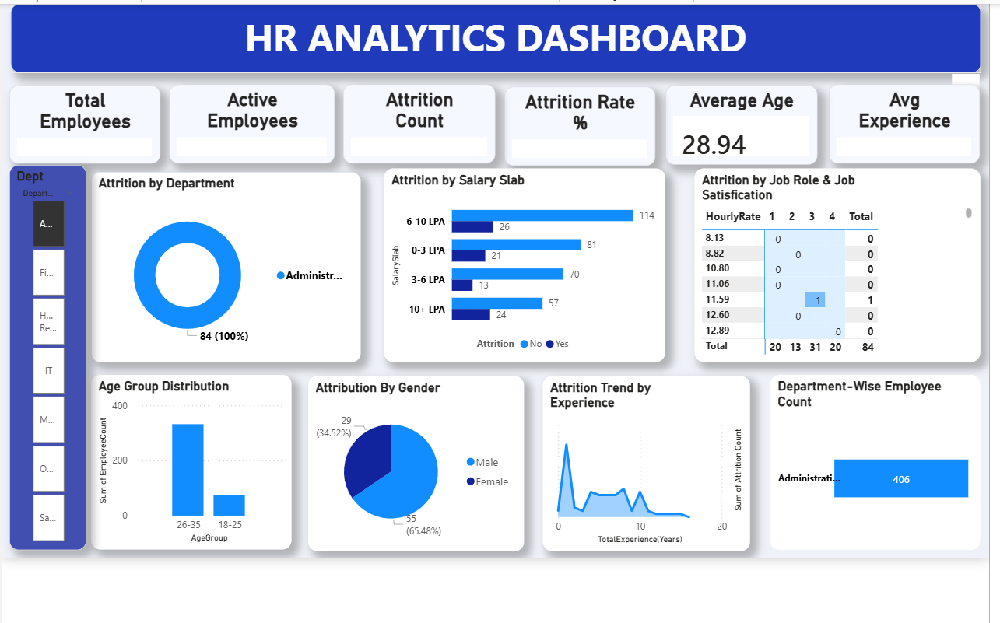

## 📊 HR Analytics Dashboard (Power BI)

## 📌 Project Overview

This project is an interactive **HR Analytics Dashboard** developed using **Microsoft Power BI** to analyze employee data and identify workforce trends. The dashboard provides insights into employee attrition, demographics, salary distribution, experience, and departmental performance, helping HR teams make data-driven decisions.

---

## 🎯 Objectives

- Monitor employee attrition.
- Analyze employee demographics.
- Understand salary-wise attrition.
- Track department-wise employee distribution.
- Identify trends based on experience.
- Provide an interactive dashboard for HR decision-making.

---

## 📈 Dashboard Preview



---

## 📊 Key Performance Indicators (KPIs)

- Total Employees
- Active Employees
- Attrition Count
- Attrition Rate (%)
- Average Employee Age
- Average Experience

---

## 📌 Dashboard Features

### 🔹 Department Filter
- Filter dashboard data by department.
- Interactive slicer for quick analysis.

### 🔹 Attrition by Department
- Displays employee attrition across departments.

### 🔹 Attrition by Salary Slab
- Analyzes attrition based on salary ranges.
- Salary Slabs:
  - 0–3 LPA
  - 3–6 LPA
  - 6–10 LPA
  - 10+ LPA

### 🔹 Job Satisfaction Analysis
- Shows employee attrition based on job satisfaction levels.

### 🔹 Age Group Distribution
- Visualizes employee distribution by age group.

### 🔹 Gender Distribution
- Displays the proportion of male and female employees.

### 🔹 Attrition Trend by Experience
- Tracks employee attrition based on years of experience.

### 🔹 Department-wise Employee Count
- Shows the total employees in each department.

---

## 🛠️ Tools & Technologies

- Microsoft Power BI
- Microsoft Excel
- Power Query
- DAX (Data Analysis Expressions)

---

## 📂 Project Files

```
HR-Analytics-Dashboard/
│
├── Dashboard.pbix
├── HR_Analytics_Data.xlsx
├── screenshots/
│   └── dashboard.png
└── README.md
```

---

## 📌 Skills Demonstrated

- Data Cleaning
- Data Transformation
- Data Modeling
- DAX Measures
- Dashboard Design
- Data Visualization
- Business Intelligence
- HR Analytics

---

## 📊 Insights Generated

- Employee attrition trends.
- Salary-wise attrition analysis.
- Department performance comparison.
- Employee demographic distribution.
- Experience-based attrition.
- Gender-wise employee analysis.

---

## 🚀 Future Improvements

- Predict employee attrition using Machine Learning.
- Add monthly hiring trends.
- Add employee performance analysis.
- Include promotion and retention metrics.
- Improve mobile dashboard responsiveness.

---

## 📧 Contact

**Name:** Ezhilrani

GitHub: https://github.com/Ezhilrani9363

LinkedIn: https://www.linkedin.com/in/ezhilnithya53

---

⭐ If you found this project useful, feel free to star the repository.
